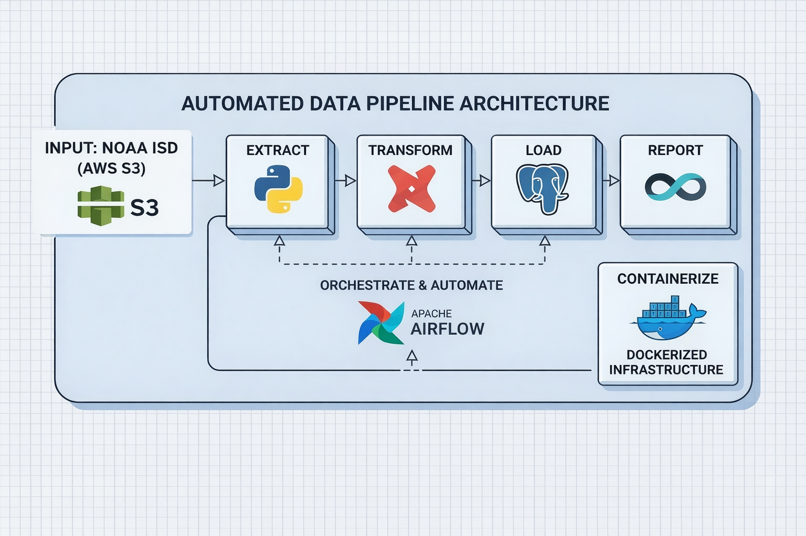
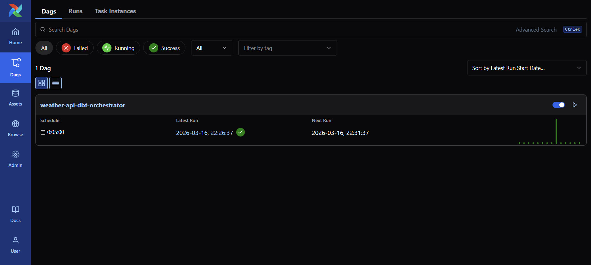
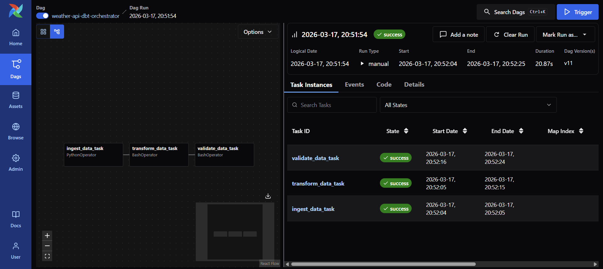
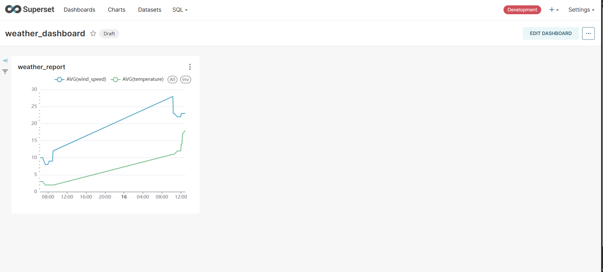

# 🌦️ Automated Weather Data ETL Pipeline

An end-to-end, fully automated data pipeline that ingests live weather data every 5 minutes, transforms it with dbt, and serves auto-refreshing dashboards via Apache Superset — everything containerised with Docker.

---

## 📐 Architecture



| Stage | Tool | What it does |
|---|---|---|
| **Extract** | Python + Weatherstack API | Fetches live weather data |
| **Load** | PostgreSQL | Stores raw data |
| **Transform** | dbt | Deduplicates, aggregates, and models the data |
| **Orchestrate** | Apache Airflow | Schedules and automates every step on a 5-min cadence |
| **Report** | Apache Superset | Live auto-refreshing dashboards |
| **Infra** | Docker + Docker Compose | Single command to run everything |

---

## 🛠️ Tech Stack

| Tool | Version | Role |
|---|---|---|
| Python | 3.x | Data ingestion scripts |
| Apache Airflow | 3.0.0 | Pipeline orchestration |
| dbt-postgres | 1.9.latest | Data transformation & modelling |
| PostgreSQL | 14.17 | Data warehouse |
| Apache Superset | 3.0.0-py310 | BI dashboards |
| Redis | 7 | Superset caching backend |
| Docker & Compose | latest | Containerised infrastructure |

---

## 📁 Project Structure

```
data_project/
├── docker-compose.yaml          # Defines all 6 services
├── .gitignore
├── images/                      # Screenshots used in this README
│
├── api_call/
│   ├── request_call.py          # Calls the Weatherstack API
│   └── insert_records.py        # Inserts data into Postgres
│
├── airflow/
│   └── dags/
│       └── orchestrator.py      # Airflow DAG: ingest → transform (every 5 min)
│
├── dbt/
│   ├── dbt_project.yml
│   ├── profiles.yml             # Postgres connection for dbt
│   └── models/
│       ├── staging/
│       │   ├── sources.yml
│       │   └── stg_weather_data.sql   # Deduplicates raw data
│       └── mart/
│           ├── daily_average.sql             # Avg temp + wind per city/day
│           └── weather_analytics_reports.sql # Reporting table
│
├── postgres/
│   ├── airflow_init.sql         # Creates Airflow DB + user
│   └── superset_init.sql        # Creates Superset DB + user
│
└── docker/
    ├── .env.example             # Template — copy to .env and fill in
    ├── superset_config.py       # Superset Python config
    ├── docker-init.sh           # Superset DB init + admin user creation
    └── docker-bootstrap.sh      # Starts Superset web server
```

---

## 🚀 How to Run Locally

### Prerequisites
- Windows with **WSL2** (Ubuntu 24.04 recommended)
- **Docker Desktop** installed and WSL2 integration enabled
- A free **Weatherstack API key** → [weatherstack.com](https://weatherstack.com)

---

### Step 1 — Enable WSL2 with Ubuntu

Open PowerShell as Administrator:
```powershell
wsl --install
wsl --set-default-version 2
wsl --install -d Ubuntu-24.04
```
Restart your machine, then open **Ubuntu** from the Start menu.

---

### Step 2 — Install Docker inside WSL

```bash
# Install Docker
curl -fsSL https://get.docker.com -o get-docker.sh
sudo sh get-docker.sh

# Add your user to the docker group (avoids sudo every time)
sudo usermod -aG docker $USER
newgrp docker

# Verify
docker --version
```

---

### Step 3 — Clone the Repository

```bash
git clone https://github.com/srujankrishnaa/weather-data-automated-etl-pipeline.git
cd weather-data-automated-etl-pipeline
```

---

### Step 4 — Configure Environment

```bash
# Copy the Superset environment template
cp docker/.env.example docker/.env
```

Open `docker/.env` and set a unique `SUPERSET_SECRET_KEY`.

Then open `api_call/request_call.py` and add your **Weatherstack API key**:
```python
API_KEY = "your_api_key_here"
```

---

### Step 5 — Fix Docker Socket Permissions (WSL only)

> ⚠️ Run this **once per WSL session** (after every system restart):

```bash
sudo chmod 666 /var/run/docker.sock
```

---

### Step 6 — Start Everything

```bash
docker-compose up
```

First run pulls all images (~2–3 GB). Subsequent starts are fast.

Wait until you see all services healthy in the terminal, then open:

| Service | URL | Credentials |
|---|---|---|
| **Airflow UI** | http://localhost:8000 | `admin` / *(see Step 7)* |
| **Superset UI** | http://localhost:8088 | `admin` / `admin` |
| **PostgreSQL** | `localhost:5000` | `db_user` / `db_password` |

---

### Step 7 — Get Airflow Password

Airflow generates a random password on first run. Retrieve it with:
```bash
docker exec airflow_container cat /opt/airflow/simple_auth_manager_passwords.json.generated
```

---

### Step 8 — Connect Superset to Your Data (one-time)

1. Go to **http://localhost:8088** → login `admin` / `admin`
2. **Settings → Database Connections → + Database**
   - Type: `PostgreSQL`
   - Host: `db` | Port: `5432` | Database: `db` | Username: `db_user` | Password: `db_password`
3. **Datasets → + Dataset** → add `dev.stg_weather_data`, `dev.daily_average`
4. **Charts → + Chart** → build your visualisation
5. **Dashboards → + Dashboard** → set auto-refresh to **5 minutes**

---

## ✅ Pipeline in Action

### Airflow — DAG Running on Schedule

The `weather-api-dbt-orchestrator` DAG runs automatically every 5 minutes:



Both tasks completing successfully in each run:



### Superset — Live Auto-Refreshing Dashboard

Weather metrics (avg temperature + wind speed) updating in real time:



---

## 🔄 Data Flow

```
Weatherstack API
      │  every 5 min (Airflow schedules)
      ▼
ingest_data_task  (PythonOperator)
      │  insert_records.py
      ▼
 dev.raw_weather_data  (Postgres)
      │
      ▼
transform_data_task  (BashOperator → docker run dbt)
      │
      ├── dev.stg_weather_data          (deduplicated staging table)
      ├── dev.daily_average             (avg temp + wind per city/day)
      └── dev.weather_analytics_reports (focused reporting columns)
                    │
                    ▼
         Apache Superset Dashboard
         (auto-refreshes every 5 min)
```

---

## 🐛 Troubleshooting

### DAG disappears from Airflow UI
**Cause:** Docker socket permission denied blocks the BashOperator from running `docker run`.  
**Fix:**
```bash
sudo chmod 666 /var/run/docker.sock
```
Then clear the failed task in the Airflow UI and re-run.

### Superset "Invalid Login"
**Cause:** `docker-compose down -v` wiped the Superset database.  
**Fix:** Re-run superset-init:
```bash
docker-compose up superset-init
```
Login credentials reset to `admin` / `admin`.

### `docker-compose up` fails on first run — Postgres port conflict
**Cause:** Something is already using port 5000 or 5432.  
**Fix:** Change the host port in `docker-compose.yaml`:
```yaml
ports:
  - "5001:5432"   # change 5000 to any free port
```

### dbt model fails — duplicate records error
**Cause:** The staging model ran before deduplication logic was in place.  
**Fix:** Drop and recreate the staging table:
```bash
docker exec dbt_container dbt run --full-refresh
```

### `docker-compose down` vs `docker-compose down -v`
| Command | Effect |
|---|---|
| `docker-compose down` | Stops containers — **data is preserved** ✅ |
| `docker-compose down -v` | Stops containers + **deletes ALL volumes** ⚠️ |

Use `down` (without `-v`) for normal restarts.

---

## 📋 User Manual

For a detailed step-by-step user manual covering every configuration option, advanced dbt model descriptions, Airflow task deep-dives, and Superset chart building, see [**project_documentation.md**](project_documentation.md).

---

## 📄 License

MIT — free to use, modify, and distribute.
